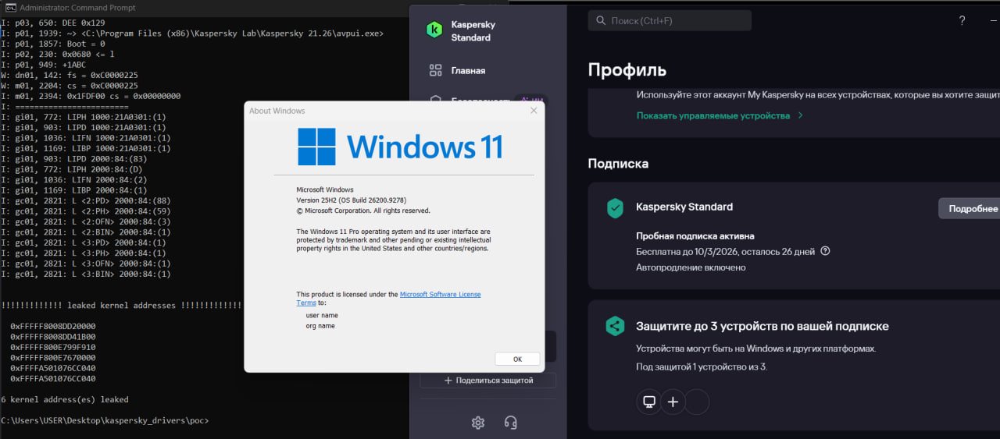

# Kaspersky arkmon.sys KASLR Bypass via Kernel Debug Log Leak

Kaspersky's anti-rootkit monitor driver (arkmon.sys) stores a kernel debug log containing raw kernel pointers. The log is "encrypted" with XOR 0xCC + ROT13 - trivially reversible. Any admin user can read and decrypt this log via IOCTL, completely defeating KASLR.

At the time of writing, the proof of concept works on a fully patched Windows 11 25H2 & Kaspersky Standard: K4W-21-26 with the latest database updates.

So what do we get? The decrypted log contains multiple kernel-space addresses (0xFFFF...) driver bases, kernel object pointers, and internal offsets. These defeat KASLR and can be used as primitives for kernel exploit chains.

```
gcc -o poc.exe poc.c
poc.exe
```

Requires admin. Kaspersky must be installed and running.


